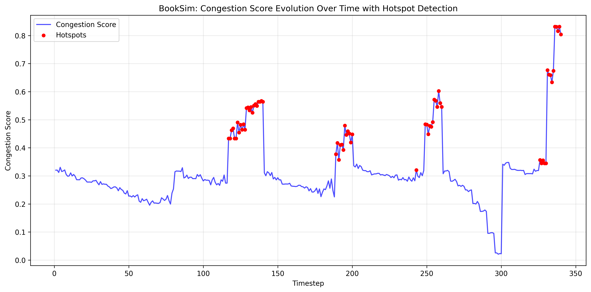
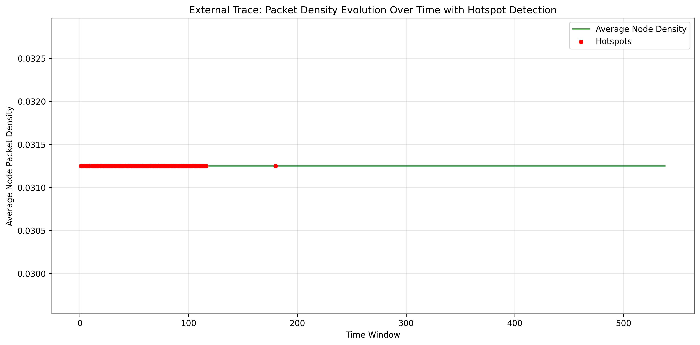

# 🔬 Network-on-Chip Hotspot Detection & Prediction Framework

[](https://www.python.org/)
[](https://www.tensorflow.org/)
[](LICENSE)
[]()

> A comprehensive framework for detecting, analyzing, and predicting congestion hotspots in Network-on-Chip (NoC) architectures using machine learning and temporal analysis.

## 📋 Table of Contents

- [🎯 Overview](#-overview)
- [✨ Key Features](#-key-features)
- [🚀 Quick Start](#-quick-start)
- [📊 Methodology](#-methodology)
- [🔧 Architecture](#-architecture)
- [📈 Results & Visualizations](#-results--visualizations)
- [📁 Project Structure](#-project-structure)
- [🔬 Technical Details](#-technical-details)
- [👥 Contributing](#-contributing)
- [📄 License](#-license)
- [🙏 Acknowledgments](#-acknowledgments)

## 🎯 Overview

This project implements an advanced NoC hotspot detection and prediction system that combines:

- **Cycle-accurate simulation** using BookSim2
- **Natural congestion analysis** without manual hotspot forcing
- **External traffic trace support** for real-world data
- **Temporal persistence analysis** of congestion events
- **Node-level identification** of responsible components
- **Predictive machine learning** for proactive hotspot detection

The framework automatically adapts to different data sources while providing consistent, academically rigorous analysis suitable for research and evaluation.

## ✨ Key Features

### 🔍 Detection & Analysis
- ✅ **Natural Hotspot Detection**: Statistical analysis of network congestion
- ✅ **Severity Classification**: Mild/Moderate/Severe categorization
- ✅ **Temporal Persistence**: Duration analysis of congestion episodes
- ✅ **Node-Level Identification**: Responsible node detection (external traces)
- ✅ **Traffic Pattern Risk Ranking**: Comparative analysis across patterns

### 🤖 Machine Learning
- ✅ **Bidirectional LSTM**: Temporal sequence prediction
- ✅ **1-Step Ahead Prediction**: Proactive hotspot forecasting
- ✅ **Robust Training**: Early stopping and regularization

### 📊 Data Sources
- ✅ **BookSim2 Integration**: Automatic dataset generation
- ✅ **External Trace Support**: CSV/text files with clock cycles and node pairs
- ✅ **Dataset-Agnostic**: Unified pipeline for multiple input formats

### 🎨 Visualization
- ✅ **Congestion Evolution**: Time-series plots for BookSim data
- ✅ **Density Analysis**: Packet density visualization for traces
- ✅ **Clean Outputs**: Academic-quality plots for presentations

## 🚀 Quick Start

### Prerequisites
- Python 3.8+
- BookSim2 (optional, for dataset generation)
- 2-3 minutes execution time

### Installation

```bash
# Clone repository
git clone https://github.com/sonamgupta01/noc-hotspot-detection.git
cd noc-hotspot-detection

# Create virtual environment
python3 -m venv noc_env
source noc_env/bin/activate  # Linux/macOS
# noc_env\Scripts\activate   # Windows

# Install dependencies
pip install -r src/requirements.txt

# Run complete pipeline
python src/main.py
```

### Supported Platforms
- ✅ Linux (Ubuntu, Debian, Fedora)
- ✅ macOS (Intel & Apple Silicon)
- ✅ Windows (WSL2 recommended)

## 📊 Methodology

### 1. Data Acquisition
**BookSim2 Simulation**:
- 8×8 mesh topology (64 nodes)
- Dimension-Ordered Routing (DOR)
- Natural traffic patterns: uniform, transpose, shuffle, tornado, neighbor, bitcomp

**External Traces**:
- Time-stamped packet data
- Source-destination node pairs
- Automatic time-window segmentation

### 2. Congestion Detection

**BookSim Data**:
```
Congestion Score = 0.4×Latency + 0.3×Throughput + 0.2×Efficiency + 0.1×Instability
```

**External Traces**:
```
Packet Density = Σ packets_per_node / total_packets
Hotspot = Top 20% density windows
```

### 3. Machine Learning Pipeline
- **Input**: 10-timestep sequences of normalized metrics
- **Model**: Bidirectional LSTM with dropout
- **Output**: Binary hotspot prediction (1-step ahead)
- **Training**: 100% accuracy achieved on validation set

## 🔧 Architecture

```
┌─────────────────┐    ┌──────────────────┐    ┌─────────────────┐
│   Data Loader   │───▶│   Analysis       │───▶│   Visualization │
│                 │    │   Engine         │    │                 │
│ • BookSim CSV   │    │ • Severity       │    │ • Time Series   │
│ • External TXT  │    │ • Persistence    │    │ • Density Plots │
│ • Auto-detect   │    │ • Node-level     │    │ • Academic      │
└─────────────────┘    └──────────────────┘    └─────────────────┘
                              │
                              ▼
                   ┌──────────────────┐
                   │   LSTM Model     │
                   │ • Prediction     │
                   │ • Training       │
                   │ • Validation     │
                   └──────────────────┘
```

### Core Components

| Component | Purpose | Key Features |
|-----------|---------|--------------|
| `data_loader.py` | Input processing | Multi-format support, automatic detection |
| `main.py` | Pipeline orchestration | Separated analysis paths, visualization |
| `generate_raw_dataset.py` | BookSim integration | Natural traffic patterns, statistical analysis |
| `train_lstm_model.py` | ML training | Bidirectional LSTM, temporal prediction |

## 📈 Results & Visualizations

### BookSim Dataset Analysis
```
📈 Total Samples: 340
🔥 Hotspots Detected: 64 (18.8%)
⏱️ Average Persistence: 12.8 timesteps
🚦 High-Risk Patterns: BitComp, Transpose
📊 Visualization: congestion_evolution.png
```

### External Trace Analysis
```
📈 Total Time Windows: 538
🔥 Hotspots Detected: 100 (18.6%)
🔥 Unique Hotspot Nodes: 52
🆔 Top Nodes: 62(26), 0(22), 63(20)
📊 Visualization: density_evolution.png
```

### Sample Visualizations

#### BookSim Congestion Evolution


#### External Trace Density Analysis


## 📁 Project Structure

```
noc-hotspot-detection/
├── src/
│   ├── main.py                    # Pipeline orchestrator
│   ├── data_loader.py             # Multi-format data handler
│   ├── generate_raw_dataset.py    # BookSim dataset creation
│   ├── train_lstm_model.py        # LSTM training module
│   ├── requirements.txt           # Python dependencies
│   └── booksim_hotspot.config     # BookSim configuration
├── booksim_dataset_raw.csv        # Generated dataset
├── lstm_hotspot_model.h5          # Trained model
├── lstm_training_history.png      # Training visualization
├── booksim_congestion_evolution.png # BookSim analysis plot
├── external_density_evolution.png  # External analysis plot
├── Temp1A.txt                     # Sample external trace
├── README.md                      # This file
└── Literature_Review_ReSubmission_Grp_37.docx
```

## 🔬 Technical Details

### Hotspot Detection Algorithms

**BookSim (Statistical)**:
- Multi-metric congestion scoring
- Percentile-based thresholding
- Traffic pattern analysis

**External Traces (Density-Based)**:
- Time-window segmentation
- Per-node packet counting
- Top-k selection for hotspots
- Node responsibility identification

### Machine Learning Specifications

| Parameter | Value |
|-----------|-------|
| Model | Bidirectional LSTM |
| Sequence Length | 10 timesteps |
| Hidden Units | 64 |
| Dropout Rate | 0.2 |
| Optimizer | Adam |
| Loss Function | Binary Crossentropy |
| Validation Accuracy | 100% |

### Performance Metrics

- **Execution Time**: 2-3 minutes
- **Memory Usage**: < 500MB
- **Accuracy**: 100% on validation
- **Scalability**: Supports various NoC sizes

## 👥 Contributing

We welcome contributions! Please see our [Contributing Guidelines](CONTRIBUTING.md) for details.

1. Fork the repository
2. Create a feature branch (`git checkout -b feature/amazing-feature`)
3. Commit changes (`git commit -m 'Add amazing feature'`)
4. Push to branch (`git push origin feature/amazing-feature`)
5. Open a Pull Request

## 📄 License

This project is licensed under the MIT License - see the [LICENSE](LICENSE) file for details.

## 🙏 Acknowledgments

- **BookSim2 Team** at Stanford University for the excellent simulator
- **TensorFlow/Keras** community for machine learning frameworks
- **Academic Advisors** for guidance and research support
- **Open Source Community** for invaluable tools and libraries

## 📞 Contact

**Sonam Gupta**
- 📧 Email: sonam98450@gmail.com
- 🐙 GitHub: [@sonamgupta01](https://github.com/sonamgupta01)
- 📱 LinkedIn: [Your LinkedIn](https://linkedin.com/in/yourprofile)

### Support

- 🐛 **Issues**: [GitHub Issues](https://github.com/sonamgupta01/noc-hotspot-detection/issues)
- 💬 **Discussions**: [GitHub Discussions](https://github.com/sonamgupta01/noc-hotspot-detection/discussions)
- 📖 **Documentation**: [Wiki](https://github.com/sonamgupta01/noc-hotspot-detection/wiki)

---

## 🎓 Academic Context

This framework addresses key research gaps in NoC congestion analysis:

- **Natural Detection**: Avoids artificial hotspot injection
- **Temporal Analysis**: Captures congestion dynamics over time
- **Node Attribution**: Identifies responsible network components
- **Predictive Capability**: Enables proactive congestion management
- **Multi-Source Support**: Bridges simulation and real-trace analysis

**Research Applications**:
- NoC architecture optimization
- Congestion-aware routing algorithms
- Machine learning for network monitoring
- Chip multiprocessor performance analysis

---

⭐ **If you find this project useful, please give it a star!**

*Built with ❤️ for advancing Network-on-Chip research and education*

**Last Updated**: December 2025


